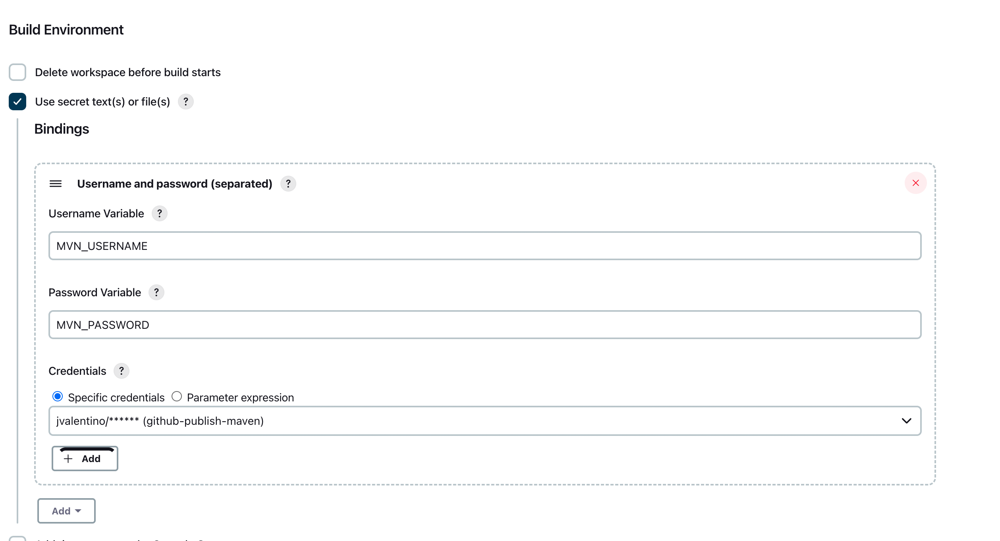
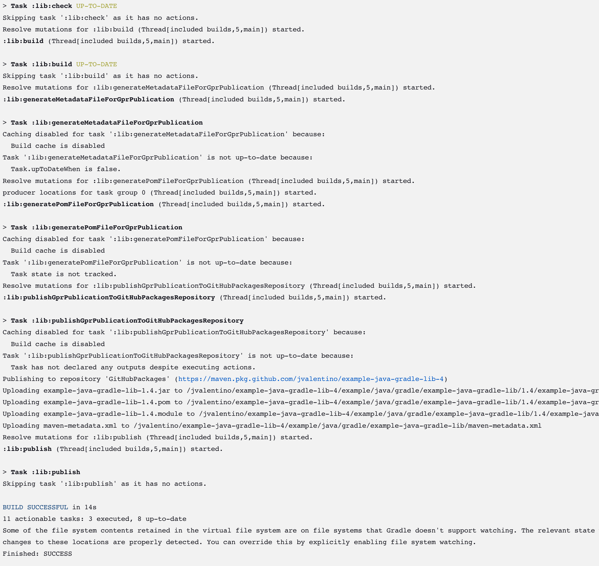

# Using a Freestyle Job to deliver Java Libraries with Gradle

Prerequisites

- Git Setup: https://github.com/jvalentino/setup-git
- Having setup Docker and Docker Compose: https://github.com/jvalentino/setup-docker
- Local Jenkins: https://github.com/jvalentino/example-docker-jenkins
- Building Java 101: https://github.com/jvalentino/java-building-101
- Gradle-Java Part 1: https://github.com/jvalentino/example-java-gradle-lib-1
- Gradle-Java Part 2: https://github.com/jvalentino/example-java-gradle-lib-2
- Gradle-Java Part 3: https://github.com/jvalentino/example-java-gradle-lib-3
- Gradle-Java Part 4: https://github.com/jvalentino/example-java-gradle-lib-4

# (1) Credentials

Since we are going to need to publish to a remote Maven repository, we are going to need to add the credentials for it (just like we did in the beginning with Git).

[Manage Jenkins](http://localhost:8080/manage/) -> [Manage Credentials](http://localhost:8080/manage/credentials/) -> [System](http://localhost:8080/manage/credentials/store/system/) -> [Global Credentials (Unrestricted)](http://localhost:8080/manage/credentials/store/system/domain/_/) 

We then create a username/password credential named `github-publish-maven` that we will later use in our job:

# (2) Initial Job Creation

This is where we are going to create the initial freestyle job to handle delivery this library as a new version on code change.

[New Item](http://localhost:8080/view/all/newJob)

## SCM

## Build Triggers

## Build Enviroment

## Build Steps

## Running it

# (3) The World of Plugins

Consider that we have a number of technologies involved with publish stuff:

- JUnit for unit testing - Built into the Jenkins Platform
- Jacoco for code coverage - Requires the [JaCoCo Plugin](https://plugins.jenkins.io/jacoco)
- PMD for static code analysis - Requires the [Warnings Next Generation Plugin](https://plugins.jenkins.io/warnings-ng)

The objective is to publish this information to where it is is easily findable on the job page, just like devs can get at it locally.

## JaCoCo

## Warnings Next Generation

# (4) Job Configuration Changes

I went a head and copied the first job into a second one for these changes.

These are all found in the "Post-build Actions" as available options.

## Publish JUnit test result report

## Record JaCoCo coverage report

## Record compiler warnings and static analysis reports

# (5) Running wth the Plugins

